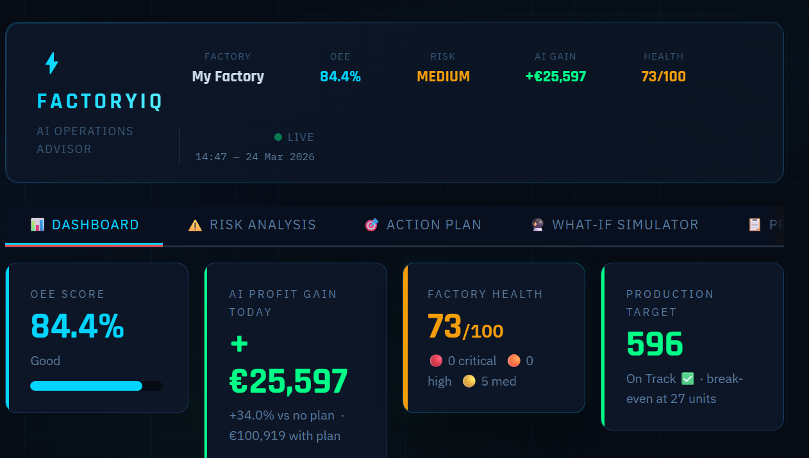

# 🏭 Risk Intelligence Engine

> **AI-powered daily briefing for factory managers** — risks scored, actions prioritised, profit impact calculated. One click.


---

## What it does

Every shift, your factory faces a different risk landscape — energy prices spike, a machine runs hot, tool wear creeps past the safe zone, demand softens. This engine pulls all of that together into a single daily briefing with a concrete action plan and a Euro-denominated profit impact.

| Capability | Detail |
|---|---|
| **7-category risk scorecard** | Machine failure · Tool wear · Thermal stress · Energy cost · Market demand · Supply chain · Workforce overload |
| **Dual ML model** | Gradient Boosting (failure, energy, quality prediction) + Q-Learning RL agent (optimal speed & staffing) |
| **Live market data** | Weather, metal prices, energy proxy, manufacturing demand index — all from free public APIs |
| **Actionable output** | Prioritised action list with exact € impact per action |
| **PDF report** | Auto-generated, download-ready briefing for every session |
| **16 industry presets** | CNC machining, aerospace, automotive, pharma, semiconductor, oil & gas, and more |

---

## Screenshots



> Run `streamlit run app.py` and open [http://localhost:8501](http://localhost:8501)

---

## Quickstart

```bash
# 1. Clone / enter the project
cd risk_intelligence

# 2. Install dependencies
pip install -r requirements.txt

# 3. Launch
streamlit run app.py
```

Requires **Python 3.8+**. No API keys needed — all market data sources are free and open.

---

## How to use

**Step 1 — Set up your factory**
Pick an industry preset in the left sidebar (or choose "Custom" to enter every parameter manually). Adjust machines, workers, shift hours, product price, material cost, and energy rate to match your operation.

**Step 2 — Set market conditions**
Click **Fetch Live Data** to pull today's temperature, metal prices, energy proxy, and demand index automatically. Or use the sliders to simulate any scenario.

**Step 3 — Upload sensor data (optional)**
Drop in any industrial CSV from your MES or historian. The engine auto-detects column names in English and French. If a column can't be matched, a manual mapping widget appears.

**Step 4 — Analyse**
Click **"Analyse My Factory"**. The AI trains and runs in seconds.

**Step 5 — Act**
Read your risk scorecard, OEE gauge, prioritised action plan, and profit comparison (with vs. without the plan). Download the PDF to share with your team.

---

## Uploading your own data

The app accepts **any industrial CSV** — no reformatting required. Column names are matched using keyword scoring across English and French synonyms.

| Feature | Recognised column names |
|---|---|
| Machine speed / RPM | `speed`, `rpm`, `rotational_speed`, `vitesse`, `spindle` |
| Torque | `torque`, `force`, `load`, `couple`, `moment` |
| Tool wear | `tool_wear`, `wear`, `runtime`, `usure`, `cycle` |
| Temperature | `temperature`, `process_temp`, `air_temp`, `celsius`, `kelvin` |
| Failure flag | `failure`, `machine_failure`, `target`, `label`, `panne`, `fault` |
| Energy | `energy`, `power`, `kwh`, `consommation` |

If fewer than two of these features are detected, the model falls back to 3,000 synthetic records based on the UCI AI4I 2020 dataset.

---

## Live market data sources

All free — no API keys, no sign-up.

| Signal | Source | Fallback |
|---|---|---|
| Ambient temperature | [Open-Meteo](https://open-meteo.com) | 20°C |
| Aluminium & copper prices | [metals.dev](https://metals.dev) | ±20% randomised estimate |
| Energy cost proxy (oil) | [World Bank](https://data.worldbank.org) | Time-of-day heuristic |
| Manufacturing demand index | [World Bank Manufacturing](https://data.worldbank.org) | Seasonal monthly average |

All responses are cached for 1 hour to avoid unnecessary API calls. Every fetch degrades gracefully — the app always produces output even when all APIs are unavailable.

---

## How the ML works

The engine trains two models on every run:

**Gradient Boosting (scikit-learn)**
Three models trained simultaneously on 7 features (speed, torque, tool wear, temperature delta, machine speed setting, energy multiplier, demand multiplier):
- Classifier → failure probability
- Regressor → energy consumption per machine
- Regressor → output quality score

**Q-Learning RL Agent**
Runs 2,000 simulated factory episodes across 90 market scenarios (6 energy levels × 5 demand levels × 3 material cost levels). Learns a Q-table mapping 27 discrete states to the (machine speed, worker fraction) pair that maximises daily profit. Exploration decays from ε=0.3 to ε≈0.05 over training.

On each run the RL agent's recommendation is passed to the action planner, which translates it into plain-language actions with € savings estimates. A Monte Carlo simulation (20 runs) then compares daily profit with vs. without the plan.

---

## Project structure

```
risk_intelligence/
├── app.py                 # Streamlit UI — main entry point
├── config.py              # Industry presets, risk thresholds, currencies, colour maps
├── risk_engine.py         # 7-category risk scoring, OEE calculation, shift planner
├── ml_engine.py           # GradientBoostingModel + QLearningAgent + MLEngine wrapper
├── action_planner.py      # Translates ML output + risks into prioritised action list
├── profit_calculator.py   # Monte Carlo with/without-plan profit comparison
├── api_fetcher.py         # Weather, metal prices, energy proxy, demand index
├── data_adapter.py        # Auto-detects and normalises columns in any uploaded CSV
├── industry_profiles.py   # Per-industry risk weight profiles
├── report.py              # ReportLab PDF report generator
└── requirements.txt       # Python dependencies
```

---

## Dependencies

```
streamlit        # Web UI framework
pandas           # Data wrangling
numpy            # Numerical operations
scikit-learn     # Gradient Boosting models
plotly           # Interactive charts (risk radar, OEE gauge, profit bars)
reportlab        # PDF report generation
```

Install everything with:

```bash
pip install -r requirements.txt
```

---

## Supported industries

CNC Machining · Steel & Metal Fabrication · Aerospace & Precision Parts · Automotive Assembly · Electronics & PCB · Semiconductor · Textile & Clothing · Food & Beverage · Pharmaceutical · Chemical & Petrochemical · Oil & Gas Refinery · Cement & Building Materials · Wood & Furniture · Packaging & Plastics · Mining & Quarrying · Custom

---

## Data & attribution

Default synthetic training data is modelled after the **UCI AI4I 2020 Predictive Maintenance Dataset**. When you upload your own CSV the model trains exclusively on your data.

---

*Risk Intelligence Engine — CITX.C 2026*